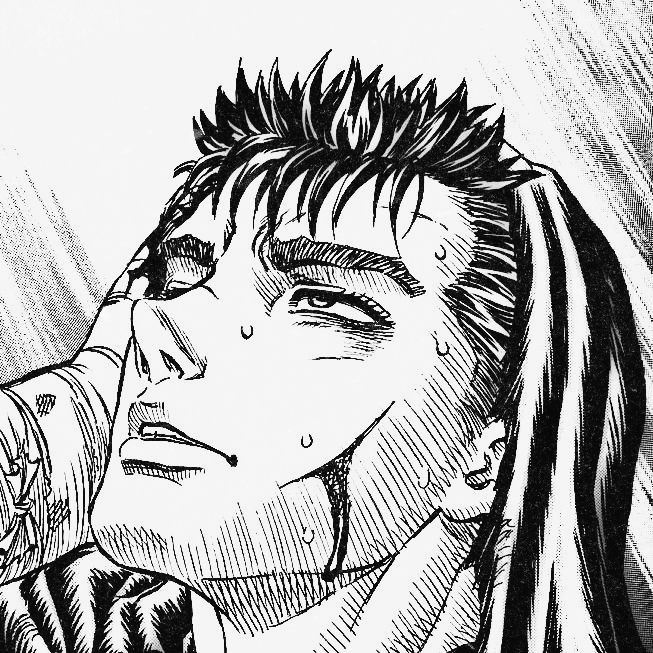

<h1 align="center">Hi there I'm Aslam </h1>
<p align="center">
    
</p>

<body>
<br>
<div align="center">

</div>
<br>

<h2 align="center"> 👁️‍🗨️ About me 👁️‍🗨️ </h2>

```zsh
> profile
```

 

```csharp
My Profile
-------------------------------
Username: false-eye.
WhoamI: Muhammed Aslam
Telegram: @false_eye
Instagram: @false_eye
FavouriteAnime: Berserk, AOT, One Piece.
Loves: Anime,Games,Music.
Pronouns: He-Him.
Location: Planet Kepler-452b.
Hobbyes: Watching Anime and Listening Music.
FavouriteSong: Robbery - Juice Wrld.
Hobbies: Watching anime, Play games while I am listening music.

```
## Now Listening 🎵:

[](https://spotify-github-profile.vercel.app/api/view?uid=31vt6yb4gnj2gdiojzsk2xucg4ii&redirect=true)

<div>
<br>
<br>
<br>
<br>

<p align="right"><a href = "https://youtu.be/IQ3SidJb1QI"></a><b><br>Cross The Globe - Lil Durk ft. Juice Wrld </b></p>
<br>
<br>

<p align="left"><a href = "https://youtu.be/NfMegACVJQw"></a><b><br><br> Surf Curse - Freaks</b></p>

<br>
<br>

<p align="right"><a href="https://youtu.be/tGFPRAFWB7M"></a><b><br>Ivan Cornejo - La Última Vez - deluxe</b></p>
<br>
</div>
<br>

<div>
<h2 align="center"> 🔎Knowledge📖 </h2>
</div>
<div align = "center">
<p align = "justify">I love watching anime & listen to music. <br></p>
<p align = "center">
     <a href="https://skillicons.dev">
         
    </a>
</p>
</div>
<br>
<br>
<br>
<br>
<br>
<br>

<h2 align = "center"> 📉 GitHub Stats</h2>
<div> 
<p align = "center">
    <a href="https://github-readme-stats.vercel.app">
        
    </a>
    <a href="https://github-readme-streak-stats.herokuapp.com">
        
    </a>
    <a href="https://github.com/ryo-ma/github-profile-trophy">
        
        
    </a>
    <a href="https://github.com/ashutosh00710/github-readme-activity-graph">
        
    </a>
</p>
</div>
<br>
<br>


<br>

<h2 align ="center"> 📝 Contact me 📝</h2>
<br> 
<div align="center">
<a href="https://github.com/false-eye" target="_blank">

</a>
<a href="https://twitter.com/false_eyee" target="_blank">

</a>
<a href="https://instagram.com/false_eye"
target="_blank">

</a>
<a href="https://wa.me/919539901834"></a>
</a>
<br>
</div>  


</div>  
<br>
<div>
<h2 align="center">Thank you for reading 🙋🏻‍♂️</h2>
<div>
<p align="center">
    
   </p>
  </div>
<br> 
<br>
    
<h1 align="center">Support Me ♥️ </h1>

<a href="https://ko-fi.com/false_eye" target="_blank"></a>
